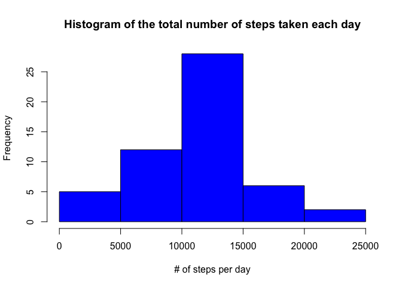
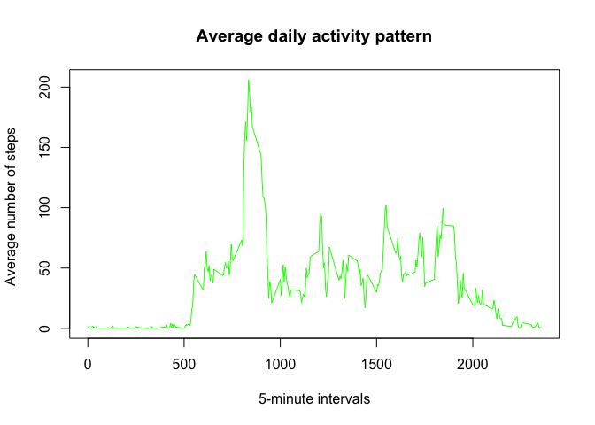
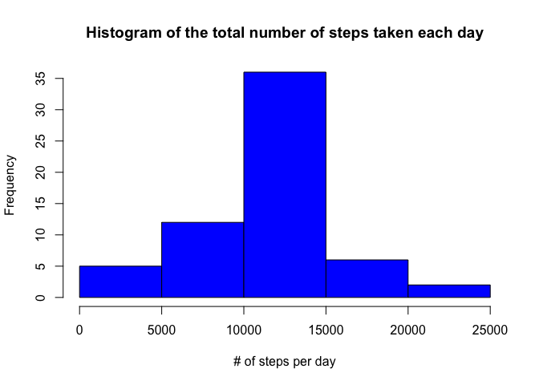
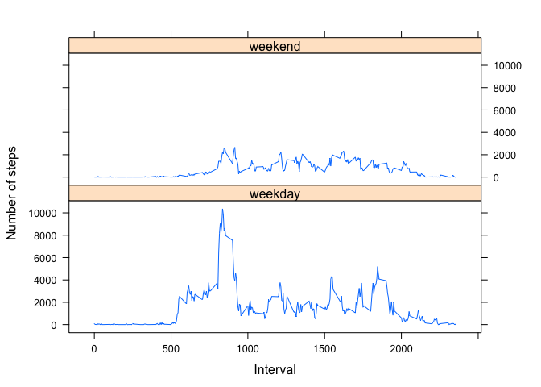

# Reproducible Research: Peer Assessment 1


## Loading and preprocessing the data

```r
activity <- read.csv(unz("activity.zip", "activity.csv"), colClasses = c("integer", "Date", "integer"))
```


## What is mean total number of steps taken per day?

### Calculating total number of steps per day

```r
activityNAFree <- activity[!is.na(activity$steps),]

totalStepsPerDay <- tapply(activityNAFree$steps, activityNAFree$date, sum)
```

### Make a histogram of the total number of steps taken each day


```r
hist(totalStepsPerDay, col = "blue", main = "Histogram of the total number of steps taken each day", xlab = "# of steps per day")
```

 

### Calculating a mean


```r
mean(totalStepsPerDay)
```

```
## [1] 10766
```

### Calculating a median


```r
median(totalStepsPerDay)
```

```
## [1] 10765
```

## What is the average daily activity pattern?


```r
avgStepsPerInterval <- tapply(activityNAFree$steps, activityNAFree$interval, mean)
intervals <- as.integer(names(avgStepsPerInterval))
```


```r
plot(intervals, avgStepsPerInterval, type = "l", col = "green", xlab = "5-minute intervals", ylab = "Average number of steps ")
title(main = "Average daily activity pattern")
```

 

### The 5-minute interval, which contains the maximum number of steps on average across all the days in the dataset


```r
names(which.max(avgStepsPerInterval))
```

```
## [1] "835"
```

## Imputing missing values

### Total number of records containing missing values


```r
sum(is.na(activity$steps))
```

```
## [1] 2304
```

### Creating a new dataset containing no missing values

A missing value will be replaced with the mean value of the interval accross all the days in the dataset

```r
steps_vector <- c()
date_vector <- c()
interval_vector <- c()

for (i in 1:nrow(activity)) {
    steps <- activity[i, 1]
    date <- activity[i, 2]
    interval <- activity[i, 3]
    
    if (is.na(steps)) {
        # Setting mean instead of a missing value
        steps <- as.integer(avgStepsPerInterval[as.character(interval)])
    }
    
    steps_vector <- c(steps_vector, steps)
    date_vector <- c(date_vector, date)
    interval_vector <- c(interval_vector, interval)
}

# Enforcing the appropriate class
class(date_vector) <- "Date"

# Building new data frame
activity2 <- data.frame(steps = steps_vector, date = date_vector, interval = interval_vector)
```


```r
totalStepsPerDay2 <- tapply(activity2$steps, activity2$date, sum)
```

### Make a histogram of the total number of steps taken each day


```r
hist(totalStepsPerDay2, col = "blue", main = "Histogram of the total number of steps taken each day", xlab = "# of steps per day")
```

 

### Calculating a mean for the dataset with replaced missing values


```r
mean(totalStepsPerDay2)
```

```
## [1] 10750
```

### Calculating a median for the dataset with replaced missing values


```r
median(totalStepsPerDay2)
```

```
## [1] 10641
```

## Are there differences in activity patterns between weekdays and weekends?


```r
# Adding new column
activity2$daytype <- as.factor(ifelse(weekdays(activity2$date) %in% c("Saturday", "Sunday"), "weekend", "weekday"))
```


```r
# Use lattice package
library(lattice)

# Aggregating data for plotting
data2plot <- aggregate(activity2$steps ~ activity2$daytype + activity2$interval, sum, data = activity2)
names(data2plot) <- c("daytype", "interval", "steps")

# Plotting
xyplot(data2plot$steps ~ data2plot$interval | data2plot$daytype, data = data2plot, layout = c(1, 2), type = "l", xlab = "Interval", ylab = "Number of steps")
```

 
